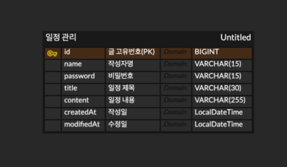

# ScheduleManagement
# API 명세서
| 기능       | method | url                      | 설명              | 응답 코드       | Request                                                                                       | Response                                                                              |
|----------|-----|--------------------------|-----------------|-------------|-----------------------------------------------------------------------------------------------|---------------------------------------------------------------------------------------|
| 일정 등록    | POST | /schedules/new           | 새로운 일정 등록       | 201 Created | { "name":"JS" "password":"1234" "contents":"내용" "date":"2025-07-31" } | { "id":1 "name":"JS" "contents":"내용" "date":"2025-07-31" }            |
| 일정 조회    | GET | /schedules/{name}   | 특정 쟉성자 글 전부 조회  | 200 OK |                                                                                               | { "id":1 "name":"JS" "contents":"내용" "date":"2025-07-31" }            |
| 일정 수정    | PUT | /schedules/{id}          | 특정 id 일정 수정     | 200 OK | { "name":"JS" "password":"1234" "contents":"내용" "date":"2025-07-31" }     | { "message":"수정 성공" "name":"JS" "contents":"내용" "date":"2025-07-31" } |
| 일정 삭제    | DELETE | /schedules/{id}          | 특정 id 일정 삭제     | 200 OK |                                                                                               | { "message":"삭제 성공" }                                                         |
| 댓글 생성    | POST | /schedules/{id}/comments | 특정 id 일정의 댓글 생성 | 201 Created | { "name":"JS" "password":"1234" "comments":"내용" "date":"2025-07-31" } | { "id":1 "name":"JS" "comments":"내용" "date":"2025-07-31" }        |

# ERD
